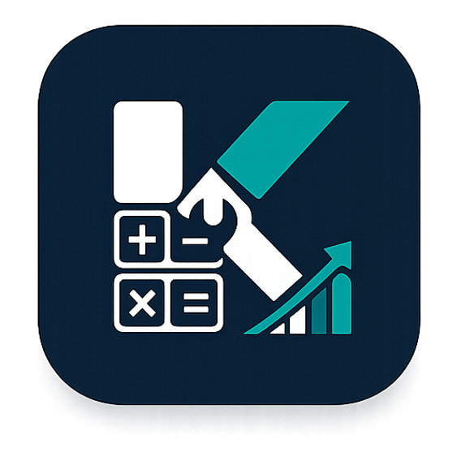
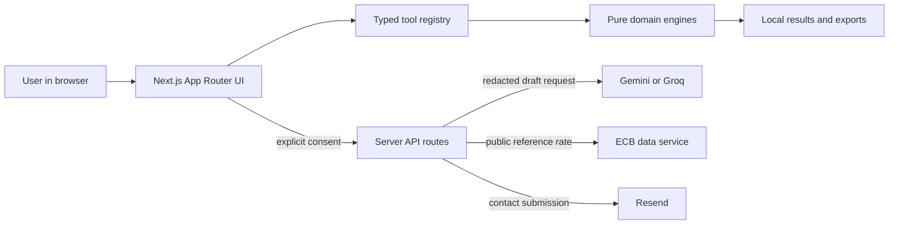

<div align="center">
  <a href="https://karobarkit.vercel.app">
    
  </a>

  <h1>KarobarKit</h1>

  <p><strong>The privacy-first business toolkit built for India.</strong></p>
  <p>
    Calculate business numbers, prepare documents, generate QR codes, and handle everyday
    operations from one transparent, mobile-friendly toolkit.
  </p>

  <p>
    <a href="https://karobarkit.vercel.app"><strong>Open KarobarKit</strong></a>
    ·
    <a href="https://karobarkit.vercel.app/tools">Browse all tools</a>
    ·
    <a href="https://karobarkit.vercel.app/methodology">Methodology</a>
  </p>

  <p>
    
    
    
    
    
    
  </p>
</div>

---

## Overview

KarobarKit is an original, source-aware toolkit for Indian freelancers, retailers, sellers,
founders, and small teams. It brings **82 calculators, generators, document workflows, and
utilities** into a single searchable application—without requiring an account.

The project is designed around three principles:

- **Trust before scale:** methods, assumptions, sources, limitations, and review status are shown
  alongside results.
- **Keep data close:** core calculations, documents, QR payloads, and file operations run in the
  browser wherever practical.
- **Useful on real devices:** the interface is mobile-first, keyboard-friendly, print-aware, and
  tested across a broad responsive matrix.

> [!IMPORTANT]
> KarobarKit provides estimates, drafts, and operational utilities—not legal, tax, accounting,
> investment, or compliance advice. Users must verify regulated outputs against current official
> guidance and their own circumstances.

## Table of contents

- [What is included](#what-is-included)
- [Why KarobarKit](#why-karobarkit)
- [Privacy and data flow](#privacy-and-data-flow)
- [Architecture](#architecture)
- [Getting started](#getting-started)
- [Environment variables](#environment-variables)
- [Available scripts](#available-scripts)
- [Testing and quality](#testing-and-quality)
- [Project structure](#project-structure)
- [Deployment](#deployment)
- [Product governance](#product-governance)
- [Contributing](#contributing)
- [License](#license)

## What is included

The registry currently publishes 82 tool routes across 12 categories.

| Category                | Examples                                                                                                             |
| ----------------------- | -------------------------------------------------------------------------------------------------------------------- |
| **Business**            | Margin, markup, pricing, break-even, cash flow, burn rate, runway, ROI, ROAS, and COD cost                           |
| **GST & Tax**           | GST, HRA, income tax, TDS, corporate tax, presumptive tax, PF, and gratuity estimates                                |
| **Finance**             | EMI, SIP, fixed deposit, CAGR, XIRR, and loan comparison                                                             |
| **Startup**             | CAC, LTV, SaaS metrics, valuation, equity dilution, and ESOP modelling                                               |
| **E-commerce**          | Marketplace margin plus Amazon and Flipkart fee estimates                                                            |
| **HR & Salary**         | CTC, in-hand salary, wage slips, leave balance, notice period, and rent receipts                                     |
| **Generators**          | Invoices, GST invoices, quotations, payment receipts, letterheads, business cards, invoice numbers, and UPI standees |
| **AI Tools**            | Business-name, pricing, startup-cost, and business-plan drafting assistants                                          |
| **Everyday Utilities**  | Percentage, discount, area, business days, fuel expense, volumetric weight, word count, passwords, and checklists    |
| **Retail & Logistics**  | Barcodes, price tags, delivery challans, shipping labels, purchase orders, and menus                                 |
| **Marketing & Digital** | WhatsApp links, vCards, Wi-Fi QR codes, email signatures, and review requests                                        |
| **Media & Files**       | Image resize/compression, PDF merge/split, favicon generation, and QR/barcode scanning                               |

Tools are driven by a typed registry that carries discovery metadata, execution mode, risk tier,
review status, source references, formulas, FAQs, and related-tool links. This keeps search, SEO,
governance, and rendering behavior aligned as the catalogue grows.

## Why KarobarKit

| Capability                      | What it means in practice                                                                                                        |
| ------------------------------- | -------------------------------------------------------------------------------------------------------------------------------- |
| **Local-first execution**       | Most inputs and outputs remain in the browser; no account is needed.                                                             |
| **Transparent results**         | Tools disclose formulas, assumptions, limitations, sources, and verification dates.                                              |
| **Indian business context**     | Indian number formatting, rupee values, GST workflows, and dated policy snapshots are built in.                                  |
| **Professional exports**        | Generate PDFs, PNGs, QR codes, barcodes, A4 documents, labels, and thermal-print layouts.                                        |
| **Safe workflows**              | Cross-tool transfers are explicit, tab-local, expiring, and consume-once. Sensitive values are excluded from URLs and analytics. |
| **Resilient AI**                | AI assistants are optional, schema-constrained, redacted, rate-limited, and backed by deterministic fallback drafts.             |
| **Accessible by design**        | Responsive layouts, keyboard journeys, semantic UI, axe checks, and print geometry are covered by browser tests.                 |
| **Security-conscious defaults** | CSP, HSTS, frame denial, MIME sniffing protection, strict referrer policy, and restricted browser permissions ship with the app. |

## Privacy and data flow

KarobarKit separates local features from the few features that require network access.

| Feature                                         | Processing boundary                                                                                                                         |
| ----------------------------------------------- | ------------------------------------------------------------------------------------------------------------------------------------------- |
| Calculators and estimators                      | Run locally in the browser using deterministic domain functions.                                                                            |
| Documents, QR codes, barcodes, images, and PDFs | Inputs and artifacts are processed locally in the browser. Files are not uploaded by these tools.                                           |
| Cross-tool handoffs                             | Use explicit, short-lived browser storage; never query parameters or analytics payloads.                                                    |
| AI assistants                                   | After explicit consent, declared fields pass through a server gateway to Gemini or Groq. Known sensitive patterns are redacted or rejected. |
| Currency reference rates                        | The server fetches public reference data from the European Central Bank. User-entered financial context is not sent to the ECB.             |
| Contact form                                    | Submitted contact details and messages are sent through the server to Resend when delivery is configured.                                   |
| Analytics                                       | Only allowlisted, non-sensitive metadata is accepted. Financial values, names, URLs, UPI IDs, document text, notes, and files are rejected. |

Provider keys are server-only. KarobarKit does not intentionally persist AI prompts or drafts, and
an installation without an AI provider key uses deterministic templates instead. Third-party
provider retention, quota, and usage terms still apply when those integrations are enabled.

## Architecture



The domain layer owns calculation and validation logic; React components focus on interaction and
presentation. Tool metadata is centralized rather than duplicated across routes. Regulated rules
use effective-dated policy records, official-source allowlists, review cadences, and an independent
kill switch.

## Getting started

### Prerequisites

- Node.js **20.9 or newer**
- npm (included with Node.js)
- Git

### Local development

```bash
git clone https://github.com/Bilal-03/karobarkit.git
cd karobarkit
npm ci
cp .env.example .env.local
npm run dev
```

Open [http://localhost:3000](http://localhost:3000).

No external service is required for the core toolkit. Without AI or email credentials, the app
still runs; AI uses deterministic fallback drafts and contact delivery remains unavailable.

## Environment variables

Start from [`.env.example`](.env.example). Never commit `.env.local` or expose server credentials
through a `NEXT_PUBLIC_` variable.

### Core and contact delivery

| Variable               | Required   | Purpose                                                                    |
| ---------------------- | ---------- | -------------------------------------------------------------------------- |
| `NEXT_PUBLIC_SITE_URL` | Production | Canonical absolute HTTPS URL used by metadata, links, and contact context. |
| `RESEND_API_KEY`       | Optional   | Server-only Resend credential for contact-form delivery.                   |
| `CONTACT_TO_EMAIL`     | Optional   | Destination for contact messages.                                          |
| `CONTACT_FROM_EMAIL`   | Optional   | Verified sender identity; defaults to the Resend onboarding sender.        |

### AI assistants

| Variable                          | Default              | Purpose                                                                                           |
| --------------------------------- | -------------------- | ------------------------------------------------------------------------------------------------- |
| `AI_PROVIDER`                     | `auto`               | `auto`, `gemini`, or `groq`. Auto prefers Gemini and falls back to Groq when both are configured. |
| `GEMINI_API_KEY`                  | —                    | Server-only Google AI Studio key.                                                                 |
| `GEMINI_MODEL`                    | `gemini-2.5-flash`   | Gemini model used for structured drafts.                                                          |
| `GROQ_API_KEY`                    | —                    | Server-only Groq key.                                                                             |
| `GROQ_MODEL`                      | `openai/gpt-oss-20b` | Groq model used for structured drafts.                                                            |
| `AI_RATE_LIMIT_PER_WINDOW`        | `8`                  | Valid requests allowed per client in a ten-minute window; accepted range is 1–100.                |
| `AI_PROVIDER_DAILY_REQUEST_LIMIT` | `250`                | Per-instance safety ceiling for provider calls.                                                   |
| `AI_RATE_LIMIT_SHARED_ENDPOINT`   | —                    | Optional atomic shared counter endpoint for multi-instance deployments.                           |
| `AI_RATE_LIMIT_SHARED_TOKEN`      | —                    | Server-only token for the shared counter.                                                         |

### Catalogue controls

| Variable                                      | Behavior                                                                                                                                                                         |
| --------------------------------------------- | -------------------------------------------------------------------------------------------------------------------------------------------------------------------------------- |
| `NEXT_PUBLIC_TOOL_FEATURE_FLAGS`              | Optional comma-separated allowlist of tool waves. When unset, reviewed and controlled-beta waves are visible by default. Setting an explicit empty value disables flagged waves. |
| `NEXT_PUBLIC_REGULATED_UTILITIES_KILL_SWITCH` | Set to `1`, `true`, `on`, or `yes` to immediately hide regulated/data-backed utilities.                                                                                          |

Default feature-flag values are documented in
[`src/domain/registry/feature-flags.ts`](src/domain/registry/feature-flags.ts).

## Available scripts

| Command                | Description                                      |
| ---------------------- | ------------------------------------------------ |
| `npm run dev`          | Start the local Next.js development server.      |
| `npm run build`        | Create an optimized production build.            |
| `npm start`            | Serve an existing production build.              |
| `npm run preview`      | Build and then serve the production application. |
| `npm run lint`         | Run ESLint with Next.js and TypeScript rules.    |
| `npm run lint:fix`     | Apply safe ESLint fixes.                         |
| `npm run typecheck`    | Run TypeScript without emitting files.           |
| `npm test`             | Run the Vitest unit and integration suite once.  |
| `npm run test:watch`   | Run Vitest in watch mode.                        |
| `npm run test:e2e`     | Run the full Playwright browser matrix.          |
| `npm run test:e2e:ui`  | Open the Playwright test UI.                     |
| `npm run format`       | Format the repository with Prettier.             |
| `npm run format:check` | Verify formatting without changing files.        |

Install Chromium once before the first browser-test run:

```bash
npx playwright install chromium
```

## Testing and quality

Before opening a pull request, run:

```bash
npm run format:check
npm run lint
npm run typecheck
npm test
npm run build
npm run test:e2e
```

The automated suite covers:

- decimal-safe calculation and validation boundaries;
- policy effective dates, official sources, and stale-data controls;
- document, PDF, QR, barcode, file, and cross-tool workflows;
- AI redaction, schema validation, limits, fallbacks, and API behavior;
- metadata, structured data, discovery, and route integrity;
- keyboard navigation, axe accessibility checks, responsive layouts, and print geometry;
- viewports at 320, 360, 390, 430, 768, 1024, 1280, 1440, and 1920 CSS pixels.

Live AI provider tests are intentionally opt-in:

```bash
PHASE6_LIVE_PROVIDER_TESTS=1 npm test -- --maxWorkers=1 tests/integration/ai-provider-contract.test.ts
```

## Project structure

```text
karobarkit/
├── public/                     Brand assets
├── src/
│   ├── app/                    Routes, API handlers, metadata, and error boundaries
│   ├── components/             Accessible UI and tool-specific forms
│   ├── domain/
│   │   ├── ai/                 AI contracts, redaction, fallbacks, and limits
│   │   ├── calculations/       Pure calculation engines
│   │   ├── documents/          Document models, validation, and formatting
│   │   ├── policies/           Effective-dated tax and regulated data
│   │   ├── qr/                 QR, UPI, vCard, Wi-Fi, and barcode domain logic
│   │   └── registry/           Tool catalogue, discovery metadata, and governance
│   ├── lib/                    Browser/server adapters, exports, SEO, and security
│   └── styles/                 Global visual system and responsive styles
├── tests/
│   ├── unit/                   Domain and utility tests
│   ├── integration/            Component and API behavior
│   └── e2e/                    Playwright browser journeys
└── docs/                       Methodology, delivery notes, and product specifications
```

## Deployment

KarobarKit is designed for a standard Node.js or Vercel deployment.

1. Set `NEXT_PUBLIC_SITE_URL` to the canonical production HTTPS origin.
2. Add only the optional server integrations you intend to operate.
3. Run `npm run build` as the build command.
4. Serve with `npm start`, or let Vercel use its Next.js defaults.
5. Run the quality gates and verify security headers on the deployed origin.

For horizontally scaled deployments, configure a shared atomic AI rate limiter. The built-in
in-process limiter is suitable for local development and bounded personal deployments, but does
not coordinate counters across multiple instances.

## Product governance

KarobarKit treats regulated calculations as maintained product policy, not timeless constants.
Each governed tool can declare:

- its risk tier and lifecycle state;
- official or authoritative sources;
- effective dates and last-verification dates;
- review cadence and reviewer status;
- assumptions, limitations, and excluded decisions;
- golden fixtures for calculation and policy boundaries.

The implementation history and release evidence live in
[`docs/product-spec`](docs/product-spec/README.md). GST-specific methodology and source verification
are available in [`docs/gst-methodology.md`](docs/gst-methodology.md) and
[`docs/gst-source-verification.md`](docs/gst-source-verification.md).

## Contributing

Thoughtful fixes, tests, accessibility improvements, source updates, and tool proposals are
welcome.

1. Fork the repository and create a focused branch.
2. Keep domain logic pure and separate from UI adapters.
3. Add or update tests for every behavior change.
4. For regulated tools, include the source, effective date, assumptions, and boundary fixtures.
5. Run all relevant quality gates.
6. Open a pull request describing the problem, approach, privacy impact, and verification performed.

Please do not include credentials, personal information, tax identifiers, payment details, or
private business documents in issues, fixtures, screenshots, or logs.

## License

This repository does not currently include an open-source license. No permission is granted to
copy, modify, or redistribute the project beyond rights provided by applicable law. Contact the
repository owner before reusing the code.

---

<div align="center">
  <strong>KarobarKit</strong><br />
  Smart tools for smarter business.
</div>
